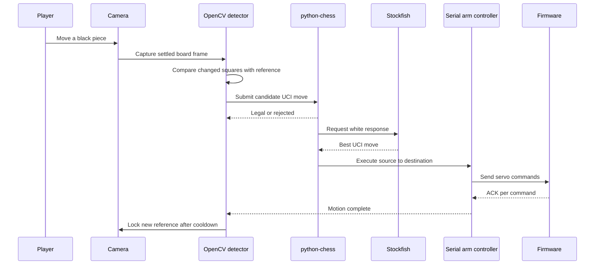

# Chess ARM

Robotic chess player that combines camera-based move detection, Stockfish decision-making, serial communication, and servo-arm actuation.

## Overview

Chess ARM is a physical AI and robotics project. A camera observes a real chess board, the Python application detects the human player's move, `python-chess` validates the move, Stockfish generates the reply, and an Arduino/ESP32-controlled arm moves the piece on the board.

This repository is a public portfolio version of the original academic project. It includes sanitized source excerpts, firmware, setup guidance, diagrams, and calibration notes. Machine-specific paths, local environment values, generated files, and model weights are intentionally excluded.

## Problem Statement

Playing chess against a physical robotic arm requires more than a chess engine. The system must reliably detect physical board changes, map pixels to chess coordinates, maintain legal game state, translate moves into mechanical poses, and coordinate with embedded hardware without treating hand or arm motion as a move.

## Proposed Solution

The project uses a modular Python pipeline:

- OpenCV captures frames and compares board squares against a locked reference image.
- `python-chess` maintains legal chess state and validates candidate UCI moves.
- Stockfish produces the engine response.
- A serial arm controller sends movement commands and waits for firmware acknowledgements.
- Servo calibration data maps all 64 board squares to hover and ground positions.

## Key Features

- Frame-difference chess move detection over an 8x8 board ROI.
- Optional YOLO/OpenCV piece-detection module for object-detection experiments.
- Stockfish integration through `python-chess`.
- Serial command protocol with acknowledgement handling.
- 64-square servo lookup table generated from calibration constants.
- Interactive board ROI calibration utility.
- Servo lookup-table validation script.
- Arduino/ESP32 firmware for smooth servo movement and browser-assisted calibration.
- Tkinter dashboard mode for camera, status, and command-log review.

## Actual Project Status

Status: hardware-dependent academic prototype.

The core Python and firmware source excerpts are included. Full operation requires the original camera/arm setup, local Stockfish binary, serial device, and board calibration. YOLO model weights and private machine configuration are not included.

## Target Users

- Faculty reviewers evaluating robotics and AI integration.
- Recruiters looking for evidence of cross-domain engineering.
- Developers interested in computer vision plus embedded-control workflows.
- Students building physical AI prototypes.

## Technology Stack

| Area | Technologies |
| --- | --- |
| Language | Python, Arduino C/C++ |
| Computer vision | OpenCV, NumPy |
| Chess logic | `python-chess`, Stockfish UCI engine |
| Hardware communication | PySerial, USB serial |
| GUI | Tkinter, Pillow, OpenCV windows |
| Embedded control | Arduino/ESP32, Adafruit PCA9685 PWM servo driver |
| Robotics | Base, shoulder, elbow, wrist, wrist rotation, and gripper servos |

## High-Level Architecture

```mermaid
flowchart LR
    Human[Human player] --> Board[Physical chess board]
    Board --> Camera[Camera feed]
    Camera --> Vision[OpenCV move detection]
    Vision --> ChessState[python-chess board state]
    ChessState --> Stockfish[Stockfish engine]
    Stockfish --> MovePlan[UCI engine move]
    MovePlan --> ArmController[Python serial arm controller]
    ArmController --> Firmware[Arduino/ESP32 firmware]
    Firmware --> Servos[Servo arm and gripper]
    Servos --> Board
```



Detailed architecture notes are in [docs/TECHNICAL_ARCHITECTURE.md](docs/TECHNICAL_ARCHITECTURE.md).

## Workflow Diagram



## Repository Contents

| Path | Purpose |
| --- | --- |
| [src/chess_arm](src/chess_arm/) | Sanitized Python modules for detection, game flow, GUI, engine, calibration, and robot commands. |
| [firmware/arm_controller](firmware/arm_controller/) | Arduino/ESP32 firmware excerpt for servo movement and calibration commands. |
| [docs](docs/) | Architecture, setup, calibration, operation, security, testing, and project-structure documentation. |
| [models](models/) | Placeholder for local YOLO weights; model files are not committed. |
| [demo](demo/) | Demo-review instructions for hardware and no-hardware review. |
| [.env.example](.env.example) | Safe environment-variable template. |

## Selected Implementation Highlights

- [src/chess_arm/test_moves.py](src/chess_arm/test_moves.py) implements the frame-difference state machine, square mapping, UCI move identification, cooldown handling, captured-piece tracking, and Stockfish response loop.
- [src/chess_arm/engine.py](src/chess_arm/engine.py) wraps Stockfish with legal move validation, FEN access, reset, game-over, and context-manager cleanup.
- [src/chess_arm/robot.py](src/chess_arm/robot.py) converts UCI moves into pick-and-place serial command sequences with acknowledgement checks.
- [src/chess_arm/config.py](src/chess_arm/config.py) contains a sanitized environment-based Stockfish/serial configuration and a generated 64-square servo lookup table.
- [firmware/arm_controller/arm_controller.ino](firmware/arm_controller/arm_controller.ino) provides the embedded servo-control layer.

Snippet provenance and sanitization notes are in [docs/code-snippets/README.md](docs/code-snippets/README.md).

## Screenshots And Demo Media

No public hardware photos or videos were included in the reviewed source material. The project can still be reviewed through the architecture diagrams, source excerpts, calibration flow, and demo checklist in [demo/README.md](demo/README.md).

## Installation

```bash
python -m venv .venv
source .venv/bin/activate
pip install -r requirements.txt
```

On Windows PowerShell:

```powershell
py -m venv .venv
.\.venv\Scripts\Activate.ps1
pip install -r requirements.txt
```

## Configuration

Use [.env.example](.env.example) as a reference. Do not commit local values.

| Variable | Purpose |
| --- | --- |
| `CHESS_ARM_STOCKFISH_PATH` | Path to the Stockfish executable or `stockfish` when it is on `PATH`. |
| `CHESS_ARM_SERIAL_PORT` | Serial port for the microcontroller, such as `COM7`. |
| `CHESS_ARM_BAUD_RATE` | Serial baud rate; the source uses `115200`. |

Board ROI and servo calibration values are documented in [docs/SETUP_AND_USAGE.md](docs/SETUP_AND_USAGE.md).

## Usage Examples

Validate servo lookup-table ranges:

```bash
python src/chess_arm/test_config.py
```

Calibrate the board region:

```bash
python src/chess_arm/calibrate_board.py
```

Run the physical chess workflow:

```bash
python src/chess_arm/test_moves.py
```

Run the dashboard workflow:

```bash
python src/chess_arm/main.py
```

## API Or Module Overview

This is a local robotics application rather than an HTTP API. The important module boundaries are:

| Module | Responsibility |
| --- | --- |
| `test_moves.py` | Main physical game flow and frame-difference move detection. |
| `vision.py` | YOLO/OpenCV piece-detection experiment and square mapping. |
| `engine.py` | Stockfish and `python-chess` integration. |
| `robot.py` | Serial movement API for the robotic arm. |
| `gui.py` / `main.py` | Tkinter dashboard runtime. |
| `calibrate_board.py` | Camera ROI calibration. |
| `test_config.py` | Servo lookup-table validation. |

## Data Flow Overview

The project does not use a database. Runtime state is held in memory as camera frames, changed-square lists, `python-chess` board state, UCI move strings, and serial movement commands.

## Security And Privacy Considerations

- Local machine paths were replaced with environment variables.
- `.env` files, Stockfish binaries, model weights, generated caches, and private hardware settings are excluded.
- The serial port and camera index are local configuration values.
- The firmware and Python code should be tested with the arm powered safely and enough clearance around the board.

## Testing And Validation

Available validation:

- `python src/chess_arm/test_config.py` checks generated servo angles for all 64 squares.
- Manual camera calibration verifies board ROI coordinates.
- Manual hardware testing verifies serial ACK behavior and servo reachability.

No automated camera/hardware integration test is included.

## Known Limitations

- Physical behavior depends on camera placement, lighting, board contrast, servo torque, and calibration quality.
- Frame-difference detection can be confused by hands, shadows, reflections, or moved pieces that return to the same square.
- Full castling, promotion, and capture handling should be validated physically before demonstration.
- YOLO model weights are not included.

## Future Improvements

- Add a simulation mode with recorded board frames.
- Add unit tests for changed-square to UCI move mapping.
- Store named calibration profiles for different boards.
- Add public-safe hardware photos and a short demo video.
- Externalize all board ROI values through config files or environment variables.

## Credits

Built as an academic robotics and AI project. Stockfish and the third-party Python/Arduino libraries remain under their respective licenses.

## License

No open-source license is granted for the portfolio material in this folder. See [LICENSE-NOT-INCLUDED.md](LICENSE-NOT-INCLUDED.md).
