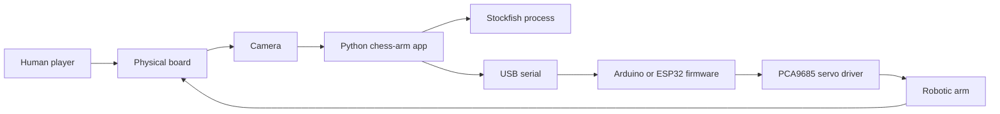
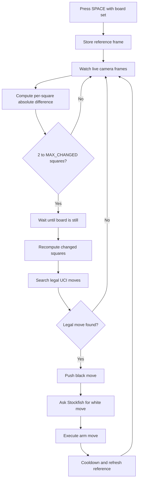

# Technical Architecture

## System Context

## Runtime Components

| Component | Source file | Responsibility |
| --- | --- | --- |
| Move detector | `src/chess_arm/test_moves.py` | Locks a reference frame, compares squares, identifies legal UCI moves, and manages game state. |
| Chess engine wrapper | `src/chess_arm/engine.py` | Starts Stockfish, validates/pushes moves, requests the engine reply, and exposes board status. |
| Robot controller | `src/chess_arm/robot.py` | Sends serial commands and waits for firmware `ACK` responses. |
| Calibration config | `src/chess_arm/config.py` | Stores local runtime config and generates a 64-square servo lookup table. |
| Vision experiment | `src/chess_arm/vision.py` | Uses YOLO/OpenCV detection and maps bounding-box centers to board squares. |
| Dashboard | `src/chess_arm/main.py`, `src/chess_arm/gui.py` | Provides GUI runtime and command-log visibility. |
| Firmware | `firmware/arm_controller/arm_controller.ino` | Runs servo movement and calibration commands on the microcontroller. |

## Move Detection Flow

## Arm Command Flow

The Python `ArmController.execute_move()` method decomposes a UCI move into source and destination squares. Each square has two calibrated poses:

- `hover`: safe travel above the square.
- `ground`: pick/place height at the square.

The movement sequence is source hover, gripper open, source ground, gripper close/hold, source hover, destination hover, destination ground, gripper open, destination hover, home.

## Supported Runtime Modes

| Command | Purpose |
| --- | --- |
| `python src/chess_arm/test_moves.py` | Main physical game workflow. |
| `python src/chess_arm/main.py` | Dashboard mode. |
| `python src/chess_arm/calibrate_board.py` | Camera board ROI calibration. |
| `python src/chess_arm/test_config.py` | Servo lookup-table validation. |
| `python src/chess_arm/chess_arm_controller.py e2e4` | Direct arm-move test. |
