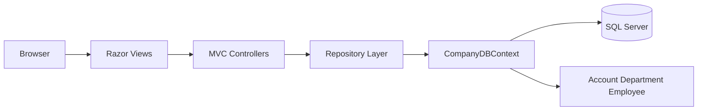
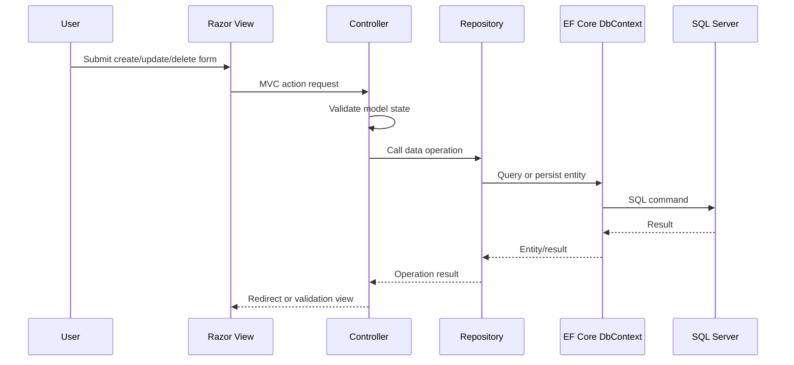
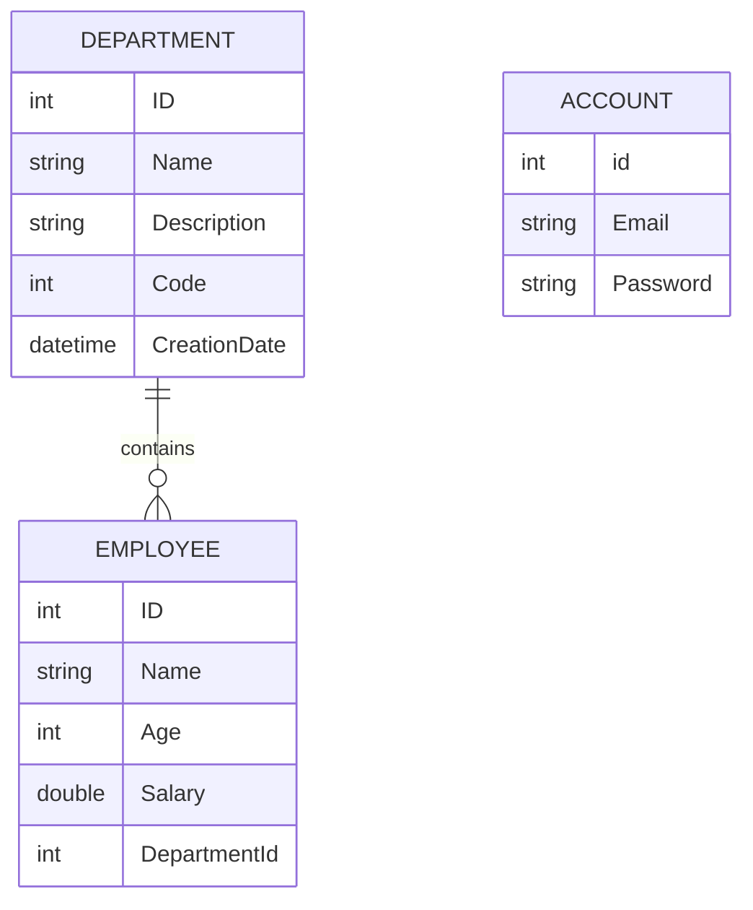

# Company Management System

ASP.NET Core MVC company-management application for account login, department CRUD, employee CRUD, and SQL Server persistence.

## Overview

Company Management System is a layered .NET 8 web application. The MVC project renders Razor views, controllers coordinate user workflows, repository classes centralize data operations, and Entity Framework Core maps account, department, and employee entities to SQL Server.

This public repository is a sanitized portfolio version of the original project. It preserves the implementation structure and selected source evidence while replacing local database configuration with environment-variable setup.

## Problem Statement

Small administrative systems need a clear way to manage organization departments and employee records while keeping web UI logic, data access, and database schema separate enough for maintainability.

## Proposed Solution

The project uses a three-project Visual Studio solution:

- `CompanyProject`: ASP.NET Core MVC web layer with controllers, Razor views, static assets, and startup routing.
- `Company.DAL`: Entity Framework Core entities, DbContext, relationship configuration, and migrations.
- `Company.Reposatory`: repository classes for account, department, and employee operations.

## Key Features

- Login-first MVC route.
- Account registration and login workflow.
- Department listing, creation, details, update, and delete.
- Employee listing, creation, update, and delete.
- Employee-to-department relationship validation.
- EF Core migrations for schema evolution.
- Razor Views with Bootstrap and jQuery validation assets.

## Actual Project Status

Status: educational full-stack MVC prototype.

The sanitized source is included and can be built with the .NET SDK. Running the app requires a local SQL Server connection string supplied through `COMPANY_DB_CONNECTION_STRING`.

## Target Users

- Faculty reviewers evaluating layered .NET application design.
- Recruiters reviewing MVC, EF Core, and SQL Server fundamentals.
- Developers studying small CRUD application structure.

## Technology Stack

| Area | Technologies |
| --- | --- |
| Runtime | .NET 8 |
| Language | C# |
| Web framework | ASP.NET Core MVC |
| ORM | Entity Framework Core 8 |
| Database | Microsoft SQL Server |
| UI | Razor Views, Bootstrap, jQuery, jQuery Validation |
| Architecture | MVC plus repository layer plus DAL project |

## High-Level Architecture



Detailed architecture notes are in [docs/TECHNICAL_ARCHITECTURE.md](docs/TECHNICAL_ARCHITECTURE.md).

## Workflow Diagram



## Repository Contents

| Path | Purpose |
| --- | --- |
| [source/CompanyProject](source/CompanyProject/) | MVC web application with controllers, views, static assets, and startup code. |
| [source/Company.DAL](source/Company.DAL/) | EF Core entities, DbContext, configuration, and migrations. |
| [source/Company.Reposatory](source/Company.Reposatory/) | Repository classes for data operations. |
| [docs](docs/) | Architecture, database, setup, workflow, testing, and security documentation. |
| [.env.example](.env.example) | Safe placeholder for database configuration. |

## Selected Implementation Highlights

- [source/CompanyProject/Program.cs](source/CompanyProject/Program.cs) configures MVC, static files, HTTPS redirection, routing, and login-first default route.
- [source/CompanyProject/Controllers/AccountController.cs](source/CompanyProject/Controllers/AccountController.cs) handles registration and login.
- [source/CompanyProject/Controllers/DepartmentController.cs](source/CompanyProject/Controllers/DepartmentController.cs) and [EmployeeController.cs](source/CompanyProject/Controllers/EmployeeController.cs) implement CRUD flows.
- [source/Company.DAL/context/CompanyDBContext.cs](source/Company.DAL/context/CompanyDBContext.cs) exposes `Departments`, `Employees`, and `Accounts`.
- [source/Company.Reposatory/EmployeeRepo.cs](source/Company.Reposatory/EmployeeRepo.cs) checks department existence before inserting an employee.

Snippet provenance and sanitization notes are in [docs/code-snippets/README.md](docs/code-snippets/README.md).

## Screenshots Or Demo Media

The original project includes UI image assets under `wwwroot/img`, but no reviewed public screenshots were available. Reviewers can run the MVC app locally after configuring SQL Server, or inspect the Razor views under [source/CompanyProject/Views](source/CompanyProject/Views/).

## Installation

```bash
dotnet restore source/CompanyProject.sln
dotnet build source/CompanyProject.sln
```

## Configuration

Set the database connection string locally:

```bash
COMPANY_DB_CONNECTION_STRING=Server=.;Database=CompanyprojectDB;Trusted_Connection=True;TrustServerCertificate=True;
```

Use [.env.example](.env.example) as a placeholder reference. Do not commit real production connection strings.

## Usage Examples

Run the MVC app:

```bash
dotnet run --project source/CompanyProject/CompanyProject.csproj
```

Apply migrations when EF Core tooling and a local SQL Server are available:

```bash
dotnet ef database update --project source/Company.DAL --startup-project source/CompanyProject
```

## API Or Module Overview

This is a server-rendered MVC application rather than a JSON API. Main route groups:

| Route group | Purpose |
| --- | --- |
| `/Account/Login` | Login form and submission. |
| `/Account/Create` | Account registration. |
| `/Department/*` | Department list, create, details, update, and delete actions. |
| `/Employee/*` | Employee list, create, update, and delete actions. |

## Database Overview



More detail is in [docs/DATABASE_DESIGN.md](docs/DATABASE_DESIGN.md).

## Security And Privacy Considerations

- The public `CompanyDBContext` reads `COMPANY_DB_CONNECTION_STRING` from the environment.
- No real `.env` file or production connection string is included.
- Current authentication is educational and stores account records directly; ASP.NET Core Identity would be a stronger future improvement.
- Generated `bin/obj` output and user-specific Visual Studio metadata are excluded.

## Testing Or Validation

No dedicated automated test project was present in the original solution. Current validation is build-based:

```bash
dotnet build source/CompanyProject.sln
```

## Known Limitations

- Authentication is intentionally simple for the academic CRUD scope.
- Repositories are manually instantiated in controllers rather than injected.
- The database must be provisioned locally.
- No automated tests are included.

## Future Improvements

- Introduce dependency injection for repositories and DbContext.
- Replace custom account logic with ASP.NET Core Identity.
- Add integration tests for MVC actions and repository behavior.
- Add seed data and a portable setup script for SQL Server.

## Credits

Built as an academic ASP.NET Core MVC project. Bootstrap, jQuery, jQuery Validation, ASP.NET Core, and EF Core remain under their respective licenses.

## License

No open-source license is granted for the portfolio material in this folder. See [LICENSE-NOT-INCLUDED.md](LICENSE-NOT-INCLUDED.md).
