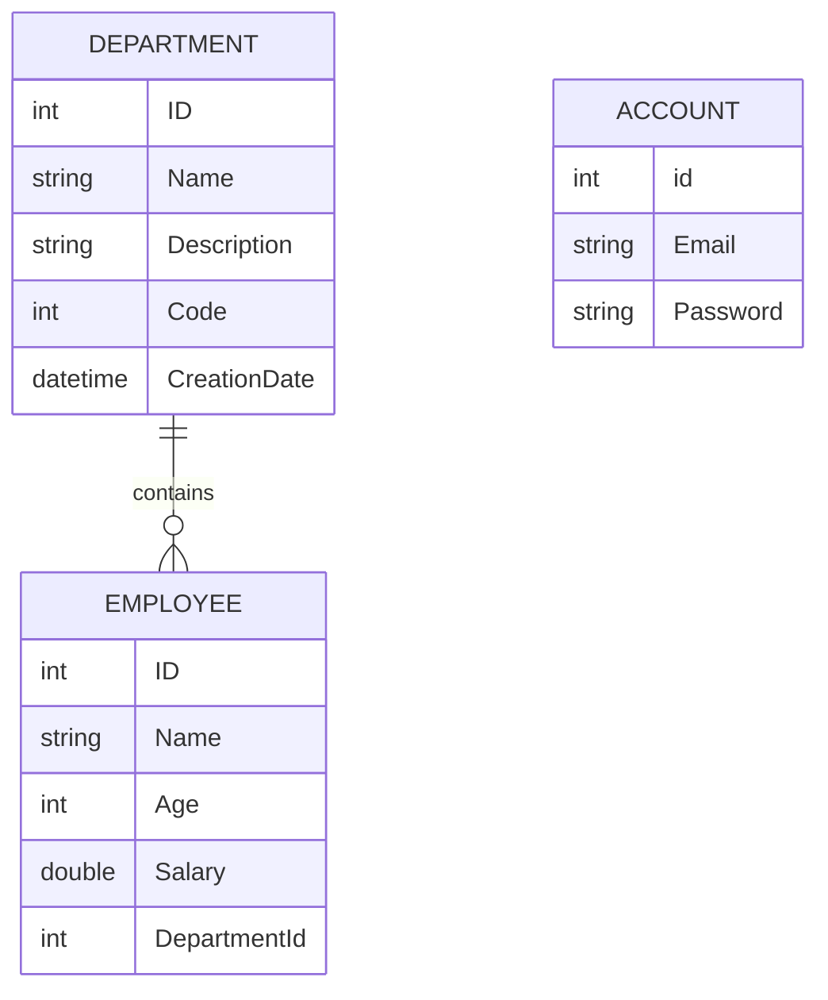

# Database Design

## Entity Model



## EF Core Context

`CompanyDBContext` exposes:

```csharp
DbSet<Department> Departments
DbSet<Employee> Employees
DbSet<Account> Accounts
```

## Relationship

The model defines a one-to-many relationship from `Department` to `Employee`. `Employee.DepartmentId` is the foreign key, and `EmployeeRepo.ADD` checks that the target department exists before saving.

## Configuration

The public portfolio copy reads the connection string from `COMPANY_DB_CONNECTION_STRING`. This replaces the original local SQL Server connection literal so private or machine-specific values are not published.
