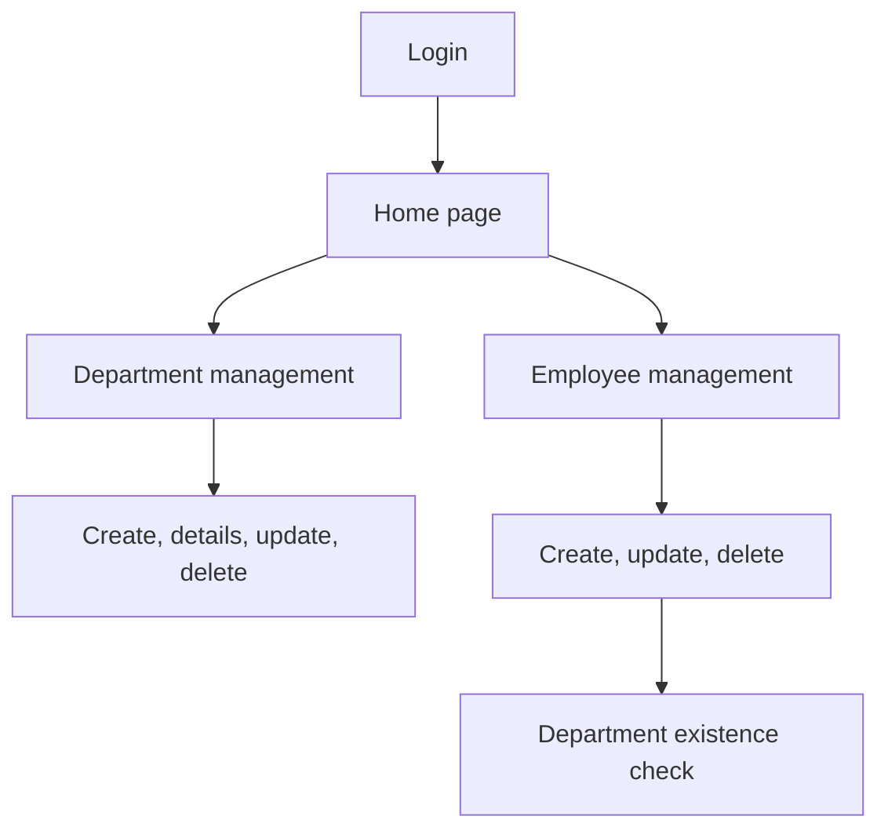

# System Design

## Design Style

The solution follows a classic MVC plus repository pattern:

- Razor Views render forms and tables.
- Controllers validate input and coordinate actions.
- Repositories perform data operations.
- `CompanyDBContext` maps entities to SQL Server.

## Main Workflows

