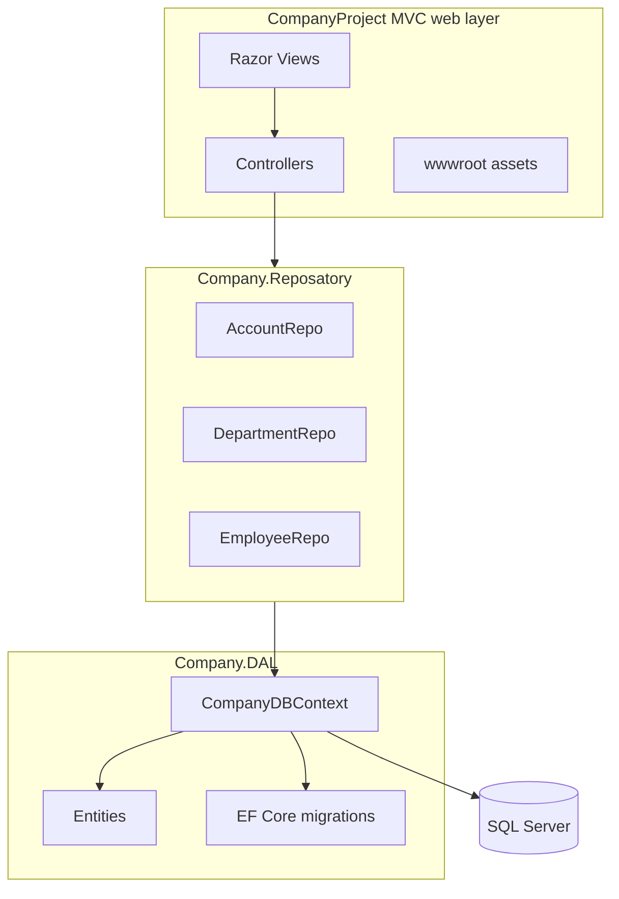

# Technical Architecture

## Layered Structure



## Startup Behavior

`Program.cs` registers MVC controllers with views, serves static files, enables HTTPS redirection, and maps the default route to:

```text
{controller=Account}/{action=Login}/{id?}
```

## Controller Responsibilities

| Controller | Responsibility |
| --- | --- |
| `AccountController` | Registration, login, TempData success messages, login error display. |
| `DepartmentController` | Department CRUD pages. |
| `EmployeeController` | Employee CRUD pages and repository-backed persistence. |
| `HomeController` | Home and default MVC pages. |

## Repository Responsibilities

| Repository | Main operations |
| --- | --- |
| `AccountRepo` | Add account and validate login. |
| `DepartmentRepo` | Get all, get by ID, add, update, delete. |
| `EmployeeRepo` | Get all, get by ID, add, update, delete; validates department existence before add. |
