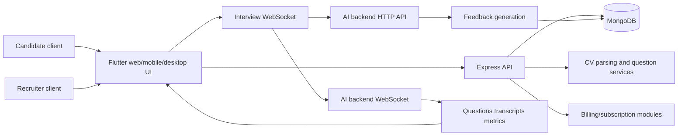
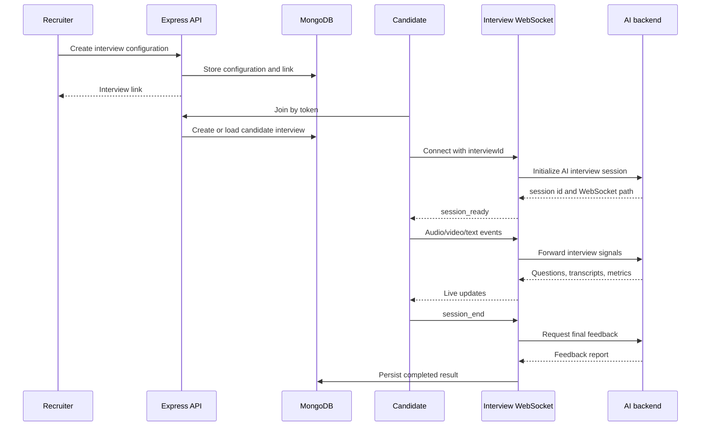
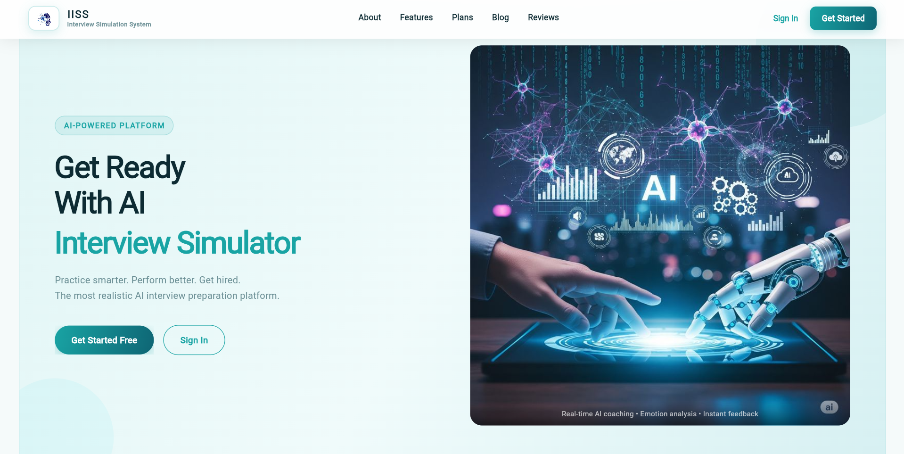
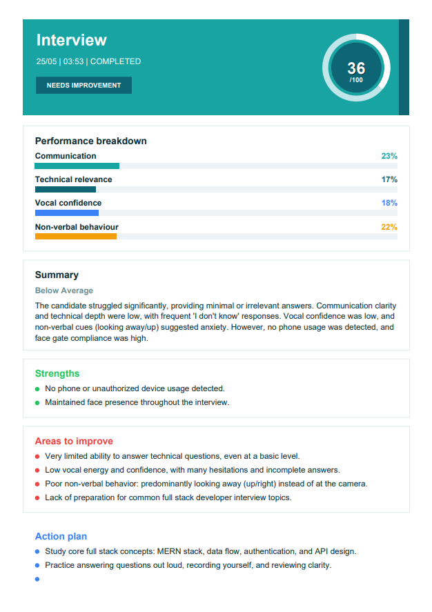
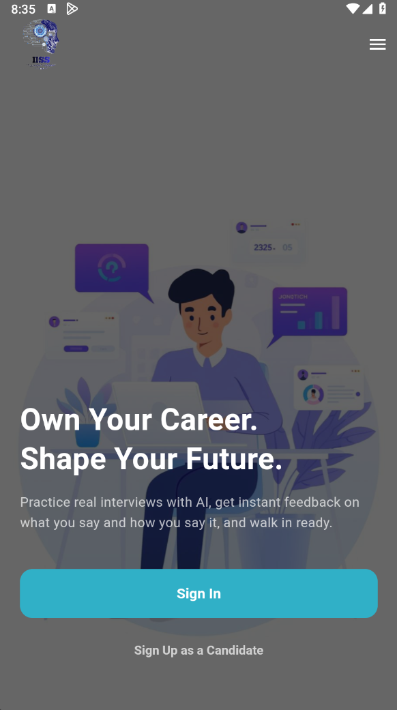

# Intelligent Interview Simulation System

AI interview-practice platform concept with recruiter/candidate flows, Flutter clients, Express/Mongo backend, WebSocket interview streaming, and multimodal feedback design.

## Overview

IISS helps candidates practice interviews and receive structured feedback from text, audio, and visual signals. The original project contains documentation, research, UI screenshots, marketing material, and a substantial implementation tree covering Flutter screens, Node/Express backend modules, MongoDB models, WebSocket session orchestration, AI-backend integration, CV parsing, subscription flows, and identity verification work.

This public folder is a sanitized portfolio case study. It does not mirror the private implementation because the Original includes `.env` files, local IPs, test credentials, logs, large generated artifacts, model files, archives, and identifiable webcam media.

## Problem Statement

Interview practice is difficult to make realistic. A useful simulator needs more than static question lists: it needs adaptive questions, speech processing, candidate-facing interaction, recruiter configuration, session integrity checks, and feedback that explains communication, technical relevance, vocal confidence, and non-verbal behavior.

## Proposed Solution

IISS combines a web/mobile/desktop experience with backend orchestration and AI services:

- Recruiters or candidates configure an interview session.
- CV data or custom question sources guide question generation.
- The interview client streams audio/video/text events over WebSocket.
- The backend initializes and bridges an AI interview session.
- The AI backend returns questions, transcripts, metric updates, and feedback.
- The system stores reports and exposes progress dashboards.
- Identity verification can gate interview access when a reference selfie is configured.

## Key Features

- Candidate and HR/recruiter roles.
- Candidate signup, HR signup, login, profile, and support flows.
- Interview configuration, interview link creation, and interview launch.
- WebSocket bridge for audio chunks, video frames, transcript updates, metric updates, questions, and completion.
- CV parsing and question-source normalization.
- Feedback reports with communication, technical, vocal, and non-verbal scoring.
- Subscription, billing, payment, and admin module structure.
- Flutter UI for web/mobile/desktop review paths.
- Identity verification design with pass/fail gating.
- Research, diagrams, poster/flyer material, and demo video evidence in the Original source.

## Actual Project Status

Status: advanced graduation-project implementation and portfolio case study.

The Original contains runnable implementation material, but this public folder intentionally includes only safe screenshots, architecture documentation, and sanitized code excerpts. A complete runnable app is not published here because private configuration, local network details, large models, and sensitive test notes were present in the source tree.

## Target Users

- Candidates practicing interviews.
- Recruiters configuring structured interview sessions.
- Faculty reviewers evaluating AI product design and system integration.
- Recruiters reviewing full-stack, real-time, and AI-integration evidence.

## Technology Stack

| Area | Technologies found in Original |
| --- | --- |
| Backend | Node.js, Express, ESM modules, MongoDB/Mongoose, JWT, bcryptjs, multer, cookie-parser, CORS |
| Realtime | `ws` WebSocket server bridging client and AI backend |
| Frontend | Flutter/Dart, Provider, HTTP client services, secure storage, file picker, camera, audio recording |
| AI integration | AI backend HTTP/WebSocket endpoints, DeepSeek workflow references, CV extraction, question normalization, feedback generation |
| Speech/media | TTS audio payloads, audio chunks, video frames, Piper/ONNX assets in Original |
| Product modules | Auth, company, HR manager, interview, progress dashboard, billing, payment, subscription, admin, support |
| Documentation/media | PDFs, research papers, diagrams, poster/flyer assets, screenshots, demo videos in Original |

## High-Level Architecture

Detailed architecture notes are in [docs/TECHNICAL_ARCHITECTURE.md](docs/TECHNICAL_ARCHITECTURE.md).

## Workflow Diagram

## Repository Contents

| Path | Purpose |
| --- | --- |
| [docs](docs/) | Project overview, architecture, setup/review guide, security notes, limitations, and snippet provenance. |
| [assets/screenshots](assets/screenshots/) | Safe public screenshots copied from the Original UI material. |
| [diagrams](diagrams/) | Diagram indexes and Mermaid-oriented documentation. |
| [research](research/) | Research package index without redistributing large copyrighted PDFs. |
| [demo](demo/) | Demo review guide. |
| [marketing](marketing/) | Poster/flyer/promo index without large binary redistribution. |

## Selected Implementation Highlights

- Express backend startup loads environment variables before imports, registers REST routes, serves uploads/downloads, opens HTTP and WebSocket servers, and checks AI backend configuration.
- Interview WebSocket bridge forwards audio/video/text events to the AI backend and relays questions, transcripts, metric updates, and completion payloads to the client.
- Flutter `InterviewService` builds multipart requests for CV, selfie, and question-set uploads and maps backend responses into UI models.
- Mongoose model structure covers users, candidate interviews, HR managers, companies, billing, subscriptions, transactions, and analytics/progress reports.
- Identity verification work gates sessions when verification is pending or failed.

Sanitized implementation excerpts are documented in [docs/code-snippets/README.md](docs/code-snippets/README.md).

## Screenshots And Demo Media

| Preview | Description |
| --- | --- |
|  | Public landing/home screen from the web experience. |
|  | Example feedback-report screen without identifiable webcam imagery. |
|  | Mobile home screen from the reviewed UI material. |

The Original also contains demo/promo videos and additional screenshots. Media with identifiable faces, private local paths, or large binary size was excluded from this public folder.

## Installation Or Demonstration Instructions

This folder is not a runnable mirror. Review it as a case study:

1. Read [docs/PROJECT_OVERVIEW.md](docs/PROJECT_OVERVIEW.md).
2. Review [docs/TECHNICAL_ARCHITECTURE.md](docs/TECHNICAL_ARCHITECTURE.md).
3. Inspect [docs/code-snippets/README.md](docs/code-snippets/README.md).
4. Open the screenshots in [assets/screenshots](assets/screenshots/).
5. Follow [demo/README.md](demo/README.md) for a portfolio walkthrough.

## Configuration Requirements

The private implementation used environment variables for backend, database, AI, JWT, email, and payment-style integrations. Real values are not published. A sanitized template is provided in [.env.example](.env.example).

## API Or Module Overview

Documented backend route groups from the Original implementation:

| Route group | Purpose |
| --- | --- |
| `/api/auth` | Candidate, HR, admin authentication and profile flows. |
| `/api/interviews` | Candidate interview creation, HR interview configuration, links, reports, and identity verification. |
| `/api/progress-dashboard` | Candidate progress and report views. |
| `/api/company` | Company profile operations. |
| `/api/hrmanager` | HR manager profile and configuration operations. |
| `/api/billing`, `/api/payments`, `/api/subscription`, `/api/subscription-plan` | Billing and subscription workflows. |
| `/api/admin` | Admin overview and management flows. |
| `/api/support` | Candidate/HR support flows. |
| `/ws/interview` | Realtime interview bridge. |

## Database Or Data-Flow Overview

The Original backend uses MongoDB/Mongoose-style models for users, candidates, HR managers, companies, interviews, interview links, interview configurations, subscriptions, payment methods, transactions, analytics reports, and progress dashboards.

## Security And Privacy Considerations

- Original `.env` files were discovered and excluded.
- Logs, private test reports, machine paths, local IPs, credentials, and large generated artifacts were excluded.
- Public screenshots were selected to avoid identifiable webcam imagery.
- Runtime secrets must be supplied locally through environment variables.
- Candidate video/audio/CV data should be handled as sensitive personal data in any real deployment.

## Testing Or Validation Information

Original notes reference end-to-end test scripts for recruiter flow, candidate regression, full interview flow, and verification flow. Those files were not published because they were tied to private local configuration and test accounts. Public validation is documentation and secret-scan based.

## Known Limitations

- This folder is not a complete runnable application.
- Original AI/backend services require private environment configuration and large local model assets.
- Some original test notes documented partial AI backend stability caveats.
- Public screenshots are a curated subset and do not prove production deployment.

## Future Improvements

- Publish a sanitized minimal demo service with mock AI responses.
- Add exported Mermaid/SVG diagrams for all major modules.
- Add a small anonymized sample transcript and feedback JSON.
- Add a public mock WebSocket replay demo.
- Replace local backend URLs in the private implementation with runtime configuration everywhere.

## Credits

Built as an academic graduation project. Any third-party research papers, AI models, media, and libraries remain under their respective licenses.

## License

No open-source license is granted for the portfolio material in this folder. See [LICENSE-NOT-INCLUDED.md](LICENSE-NOT-INCLUDED.md).
