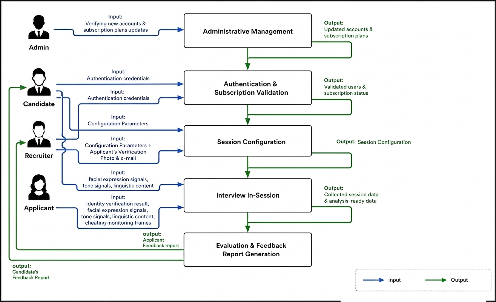

# Architecture Diagrams

These architecture exports were copied from the original IISS documentation package and renamed for clear GitHub links.

| Diagram | Purpose |
| --- | --- |
| [System_Architecture.png](System_Architecture.png) | High-level system architecture for the web, mobile, desktop, backend, AI, and data components. |
| [Block_Diagram.png](Block_Diagram.png) | Main project block diagram showing the major functional modules. |
| [Website_Map.jpg](Website_Map.jpg) | Website/navigation map for the IISS web experience. |

The text-based architecture diagrams in [../../docs/TECHNICAL_ARCHITECTURE.md](../../docs/TECHNICAL_ARCHITECTURE.md) and [../../docs/SYSTEM_DESIGN.md](../../docs/SYSTEM_DESIGN.md) remain useful for quick review; these image exports preserve the original visual documentation.

## Preview

