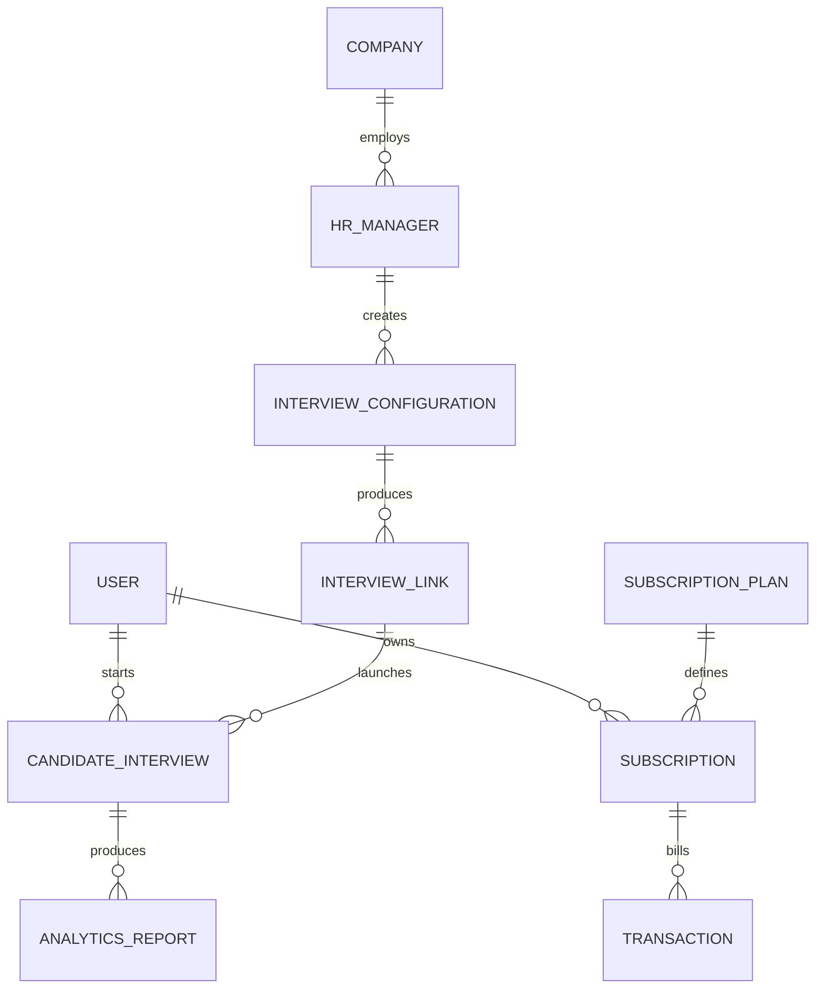

# Database And Data Model Overview

The Original backend uses MongoDB/Mongoose-style models. The public folder does not include the private database schema in full, but the model filenames and services support this domain model.

## Core Collections

| Model area | Purpose |
| --- | --- |
| User/Candidate/HR | Role-based account and profile data. |
| Company | Recruiter organization profile. |
| InterviewConfiguration | HR-defined job role, question source, CV/selfie/question-set inputs. |
| InterviewLink | Tokenized candidate launch flow. |
| CandidateInterview | Interview status, AI backend session, questions, metrics, verification status, and final result. |
| ProgressDashboard/AnalyticsReport | Candidate progress and report surfaces. |
| Billing/Subscription/Transaction | Plan and payment workflow. |

## Sensitive Data Note

Real CVs, webcam frames, audio, identity images, and payment-related data must be treated as sensitive. No real database data is included in this public case study.
