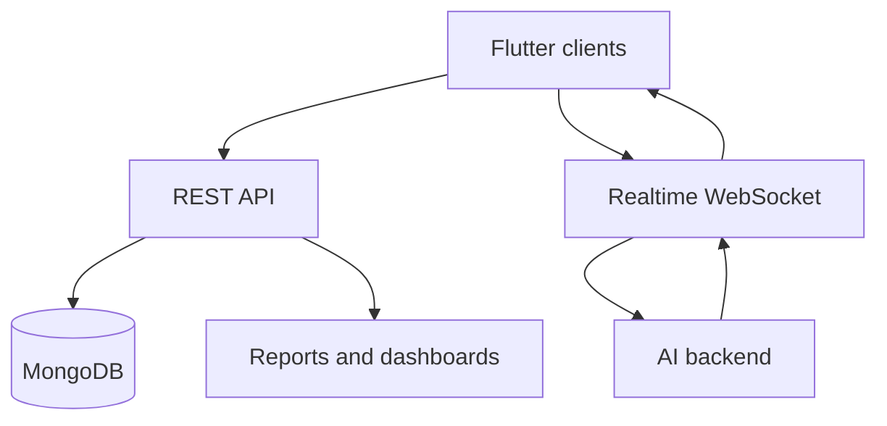

# System Design

## Design Boundaries

IISS is split into client, API, database, realtime bridge, and AI-service layers.

## Session Design

- REST creates or loads interview configuration.
- WebSocket owns realtime media/event exchange.
- AI backend owns question generation, speech/visual signal handling, and feedback.
- Backend persists status, questions, metrics, and final reports.
