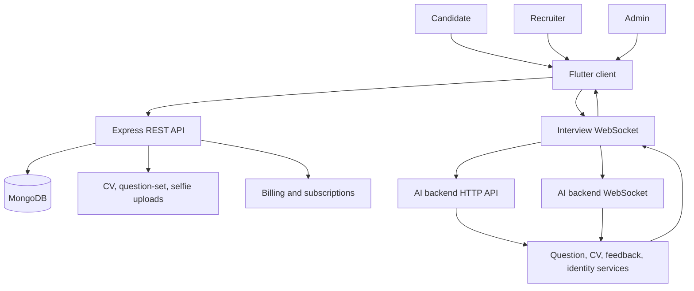
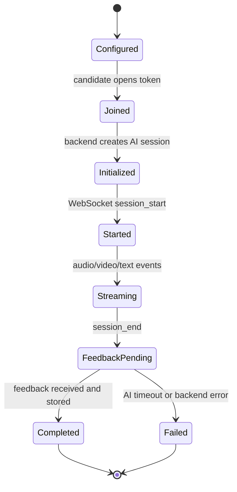
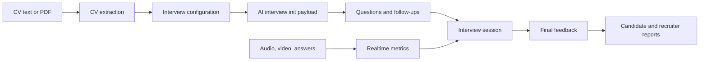

# Technical Architecture

## System Context

## Backend Modules

| Module area | Responsibility |
| --- | --- |
| Auth | Candidate, HR, and admin signup/login/profile flows. |
| Interview | Candidate interview sessions, HR configurations, links, reports, and launch flow. |
| WebSocket | Realtime bridge between Flutter clients and AI backend sessions. |
| CV | CV text extraction and AI-normalized role/experience metadata. |
| Billing/payment | Subscription plans, transactions, and payment method flow. |
| Admin | Admin overview and management routes. |
| Support | Candidate/HR support routes. |

## Realtime Interview Lifecycle

## Data Flow

## Important Engineering Decisions

- The backend loads `.env` before module imports so top-level `process.env` reads see configured values.
- Realtime messages are normalized into explicit event envelopes.
- Candidate-facing completion uses cached final payloads so reconnecting clients can receive final state.
- AI feedback is polled after session end, with a fallback endpoint path in the original WebSocket code.
- Identity verification can block WebSocket session startup when verification is pending or failed.
