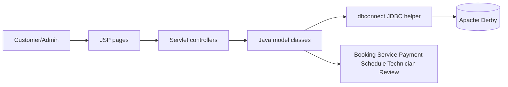
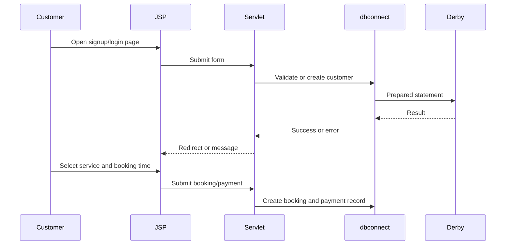

# Car Service Center

Software Engineering 1 and 2 case study covering requirements, UML design, Java domain modeling, JSP/Servlet implementation, Derby database access, and prototype TestNG tests.

## Overview

Car Service Center documents and implements a service-center workflow for customers, administrators, technicians, bookings, schedules, payments, and reviews. The project is valuable because it shows the academic software engineering lifecycle from requirements and diagrams through Java implementation and testing artifacts.

This public repository is a sanitized portfolio version of the original project. It includes selected source, design diagrams, setup guidance, and clear notes about incomplete/prototype areas.

## Problem Statement

A car service center needs to manage customer registration, service browsing, booking, scheduling, technician assignment, and payment. The academic challenge was to model those requirements formally, design the system with UML/MVC diagrams, then implement representative Java workflows.

## Proposed Solution

The project is organized into two learning phases:

- Software Engineering 1: proposal, requirements, use cases, activity diagrams, architecture diagrams, class diagrams, and sequence diagrams.
- Software Engineering 2: Java domain model, JSP/Servlet web application, Derby JDBC access, payment/booking workflows, and generated TestNG test artifacts.

## Key Features

- Customer registration and login.
- Service/product browsing pages.
- Booking and schedule workflows.
- Technician assignment concepts.
- Card and cash payment logic.
- Administrator service and booking-management concepts.
- Review/feedback domain model.
- Maven Java domain-model prototype.
- NetBeans Ant JSP/Servlet web applications.
- UML, Draw.io, Simple UML, and architecture image artifacts.

## Actual Project Status

Status: academic lifecycle case study with prototype implementation.

The domain model and web-app source are included. Running the web apps requires local Java EE/NetBeans/Ant/Derby setup. The included TestNG files are generated prototypes and contain explicit `fail("The test case is a prototype.")` calls, so they should be treated as testing evidence rather than a passing suite.

## Target Users

- Faculty reviewers evaluating requirements-to-implementation traceability.
- Recruiters reviewing Java, JSP/Servlet, JDBC, and UML evidence.
- Students studying software engineering deliverable structure.

## Technology Stack

| Area | Technologies |
| --- | --- |
| Domain model | Java 21, Maven |
| Web application | Java EE Servlets, JSP, NetBeans Ant project |
| Database | Apache Derby via JDBC |
| Frontend | JSP, HTML, CSS, JavaScript |
| Testing artifacts | TestNG generated tests |
| Design artifacts | Draw.io, Simple UML `.simp`, PNG/JPEG diagram exports |

## High-Level Architecture



More detail is in [docs/TECHNICAL_ARCHITECTURE.md](docs/TECHNICAL_ARCHITECTURE.md).

## Workflow Diagram



## Repository Contents

| Path | Purpose |
| --- | --- |
| [docs](docs/) | Requirements, use cases, activity, architecture, testing, and team indexes. |
| [diagrams](diagrams/) | Use-case, activity, architecture, class, and sequence diagrams. |
| [source/domain-model-maven](source/domain-model-maven/) | Java 21 Maven domain-model prototype. |
| [source/java-web](source/java-web/) | Main JSP/Servlet web application. |
| [source/java-web-carservice](source/java-web-carservice/) | Additional Java web implementation. |
| [demo](demo/) | Review and demonstration guidance. |
| [.env.example](.env.example) | Safe Derby configuration template. |

## Selected Implementation Highlights

- [source/domain-model-maven/carservice-center/src/main/java/com/service/carservice/center/Booking.java](source/domain-model-maven/carservice-center/src/main/java/com/service/carservice/center/Booking.java) models booking creation, status changes, technician assignment, service association, and cancellation/update/confirmation behavior.
- [source/java-web/WebApplication1/src/java/Controller/SignupController.java](source/java-web/WebApplication1/src/java/Controller/SignupController.java) handles signup form input and redirects to login on success.
- [source/java-web/WebApplication1/src/java/model/dbconnect.java](source/java-web/WebApplication1/src/java/model/dbconnect.java) centralizes JDBC operations for signup, login, booking, schedule checks, and payments.
- [source/java-web/WebApplication1/web](source/java-web/WebApplication1/web/) contains JSP pages for login, signup, home, booking, and product/service browsing.
- [diagrams](diagrams/) contains preserved architecture and UML artifacts from the original software-engineering deliverables.

Snippet provenance and sanitization notes are in [docs/code-snippets/README.md](docs/code-snippets/README.md).

## Screenshots And Demo Media

Selected design and UI assets are included as project evidence:

- [SE1 architecture screenshot](diagrams/architecture/se1/architecture-design/Screenshot%202024-10-19%20224821.png)
- [SE2 MVC screenshot](diagrams/architecture/se2-mvc/architecture-design/Screenshot%202024-10-25%20204125.png)
- [Use-case diagram image](diagrams/use-case/se1-use-case/WhatsApp%20Image%202024-05-10%20at%206.32.29%20PM.jpeg)
- [Car-service web images](source/java-web-carservice/carservice/web/img/)

Large Office documents and archives were excluded from the public source publish.

## Installation

Maven domain model:

```bash
cd source/domain-model-maven/carservice-center
mvn compile
```

NetBeans web app:

```bash
cd source/java-web/WebApplication1
ant
```

The Ant workflow expects a compatible local Java EE/NetBeans environment.

## Configuration

Use [.env.example](.env.example) as a safe placeholder reference:

```bash
CAR_SERVICE_DB_URL=jdbc:derby://localhost:1527/ProjectSoftware
CAR_SERVICE_DB_USER=YOUR_DATABASE_USER_HERE
CAR_SERVICE_DB_PASSWORD=YOUR_DATABASE_PASSWORD_HERE
```

The public `dbconnect.java` reads these values from environment variables instead of publishing the original local credentials.

## Usage Examples

Run the Maven prototype when a main class is available:

```bash
cd source/domain-model-maven/carservice-center
mvn exec:java
```

Deploy the web app through NetBeans/Ant to a Java EE server and open the JSP flow:

```text
SignupPage.jsp -> LoginPage.jsp -> homePage.jsp -> product.jsp -> booking.jsp
```

## API Or Module Overview

Servlet routes documented from source:

| Servlet | Route | Purpose |
| --- | --- | --- |
| `SignupController` | `/signup` | Customer signup. |
| `LoginController` | `/login` | Customer login/session flow. |
| `BookingController` | Booking route in source | Loads schedules and forwards booking data. |
| `PaymentController` | Payment route in source | Handles card/cash payment flow. |
| `ScheduleController` | Schedule route in source | Supports schedule-related interactions. |

## Database Or Data-Flow Overview

The web implementation uses JDBC against Apache Derby. `dbconnect.java` contains operations for customer signup/login, booking creation, schedule availability, card payment, and cash payment. More detail is in [docs/DATABASE_DESIGN.md](docs/DATABASE_DESIGN.md).

## Security And Privacy Considerations

- Original hard-coded Derby username/password values were replaced with environment variables in the public copy.
- Real database files, Office documents, archives, local IDE metadata, generated WAR/build folders, and user-specific files are excluded.
- The current password-handling flow is educational and should be hardened before production.

## Testing Or Validation Information

The source contains TestNG test files for model classes, but they are generated prototypes with explicit failing placeholders. They show testing intent and model coverage targets, not a passing test suite. See [docs/TESTING.md](docs/TESTING.md).

## Known Limitations

- Web execution depends on a local Java EE server and Derby database.
- TestNG files require completion before they can validate behavior.
- Direct JDBC helper logic could be refactored into DAO/service layers.
- Some diagrams and names preserve original academic spelling.

## Future Improvements

- Add SQL schema and seed scripts.
- Complete TestNG tests with real fixtures.
- Add password hashing and stronger validation.
- Consolidate duplicate web-app variants.
- Migrate the web app to a modern Maven/Gradle build.

## Credits

Built as an academic Software Engineering 1 and 2 project. Third-party libraries and tools remain under their own licenses.

## License

No open-source license is granted for the portfolio material in this folder. See [LICENSE-NOT-INCLUDED.md](LICENSE-NOT-INCLUDED.md).
