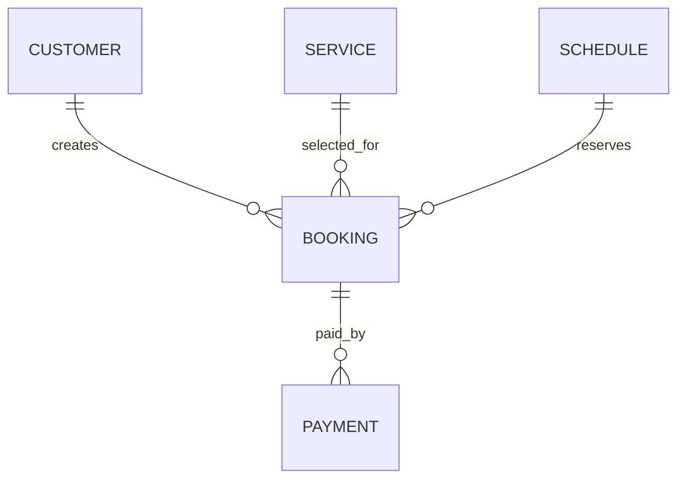

# Database Design

The original web implementation uses Apache Derby through JDBC. A full SQL schema file was not included in the public project, but table usage can be inferred from `dbconnect.java`.

## Tables Referenced In Source

| Table | Referenced fields or purpose |
| --- | --- |
| `CUSTOMER` | Customer signup and login. |
| `SERVICE` | Service lookup by service name. |
| `BOOKING` | Booking date, start/end time, customer ID, service ID, status. |
| `SCHEDULE` | Available schedule rows with start/end time. |
| `PAYMENT` | Payment ID, booking ID, amount, date, status, payment type. |
| `PAYMENTTEST` | Card payment detail prototype. |
| `CASHPAYMENT` | Cash amount recording. |

## Inferred Entity Relationships



This ERD is inferred from JDBC queries and should be confirmed against a future exported Derby schema.

## Configuration

The public copy expects:

```bash
CAR_SERVICE_DB_URL=jdbc:derby://localhost:1527/ProjectSoftware
CAR_SERVICE_DB_USER=YOUR_DATABASE_USER_HERE
CAR_SERVICE_DB_PASSWORD=YOUR_DATABASE_PASSWORD_HERE
```
