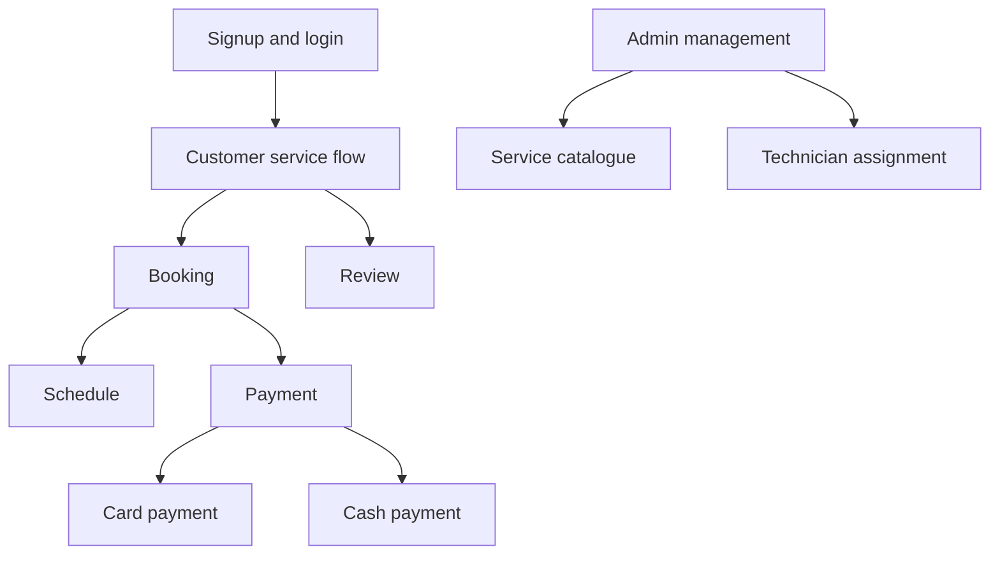

# System Design

## System Actors

- Customer: signs up, logs in, browses services, books, pays, and reviews.
- Administrator: manages services, schedules, bookings, technicians, and reports conceptually.
- Technician: receives assignments and views schedules conceptually.

## System Modules

