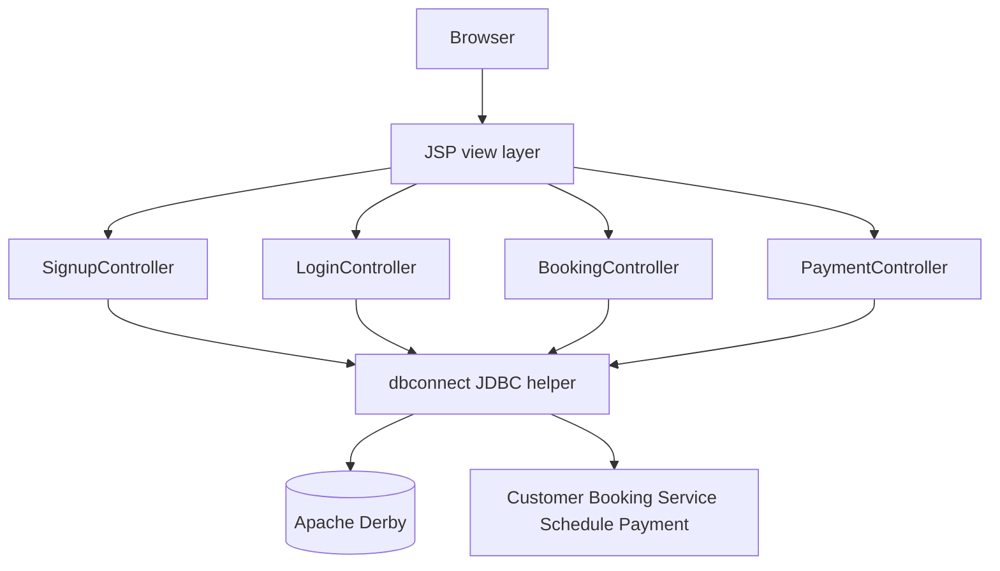
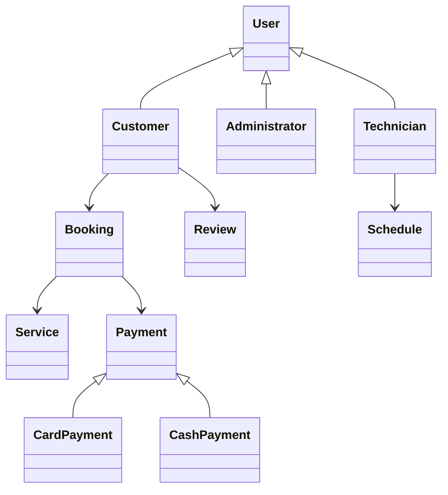

# Technical Architecture

## Web MVC Flow

## Domain Model

## Major Source Areas

| Area | Path | Responsibility |
| --- | --- | --- |
| Domain model | `source/domain-model-maven/carservice-center` | Java 21 object model prototype. |
| Main web app | `source/java-web/WebApplication1` | JSP/Servlet implementation with controllers, models, views, and tests. |
| Additional web app | `source/java-web-carservice/carservice` | Alternate web implementation with admin and booking pages. |
| Design artifacts | `diagrams/*` | Use-case, architecture, class, and sequence artifacts. |

## Data Access Design

`dbconnect.java` uses prepared statements for customer signup/login, bookings, schedules, and payments. The public copy reads database connection settings from environment variables.
