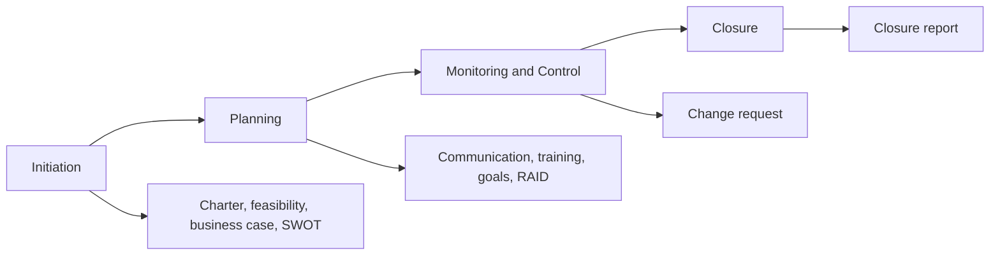
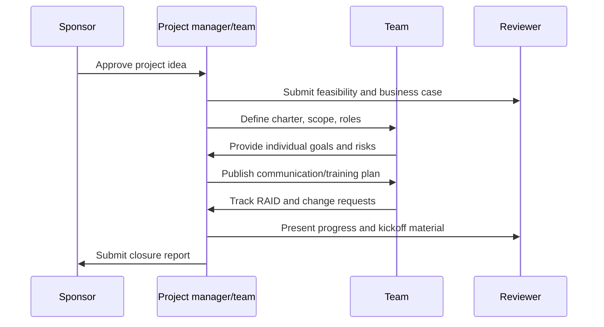

# IISS Software Project Management Case Study

Project-management portfolio package for the Intelligent Interview Simulation System, covering initiation, planning, monitoring/control, closure, scheduling, risk, communication, and governance.

## Overview

This project presents the Software Project Management work behind IISS. The Original source is a compact documentation set containing Word and PowerPoint deliverables for feasibility, business case, charter, SWOT, communication, training, RAID, individual goals, change request, closure report, and kickoff presentation.

This public repository converts that private Office-document package into a GitHub-friendly case study with lifecycle documentation, artifact catalogues, management diagrams, and review guidance. The original binary documents are not redistributed.

## Problem Statement

A complex AI graduation project needs more than implementation. It needs clear scope, feasibility analysis, stakeholder communication, schedule planning, risk control, change management, and closure documentation so the work can be planned, monitored, reviewed, and handed over.

## Proposed Solution

The SPM package organizes the IISS project-management work into a lifecycle:

- Initiation: feasibility study, business case, project charter, SWOT analysis.
- Planning: communication plan, training plan, individual goals, RAID log.
- Monitoring and control: change request process.
- Closure: project closure report.
- Presentation: stakeholder kickoff material.

## Key Features

- PMBOK-inspired lifecycle organization.
- Feasibility and business justification artifacts.
- Project charter and scope-control evidence.
- SWOT and RAID risk analysis.
- Communication and training planning.
- Individual-goal alignment.
- Change-request governance.
- Closure reporting and lessons-learned structure.
- Repository-management guidance for naming, ordering, and artifact placement.

## Actual Project Status

Status: documentation and project-management case study.

There is no executable application in this folder. The project is reviewed through Markdown documentation, artifact indexes, and diagrams derived from the original management deliverables.

## Target Users

- Faculty reviewers evaluating project-management maturity.
- Recruiters looking for planning, governance, documentation, and communication evidence.
- Students learning how to organize software project-management deliverables.

## Technology Stack

| Area | Tools and methods |
| --- | --- |
| Planning | PMBOK-inspired lifecycle and knowledge areas |
| Documentation | Microsoft Word deliverables summarized as Markdown |
| Presentation | Microsoft PowerPoint kickoff material summarized as Markdown |
| Scheduling | Microsoft Project workflow referenced by repository structure |
| Repository organization | GitHub-style folders, ordered naming, artifact indexes |

## High-Level Architecture

Detailed management architecture is in [docs/TECHNICAL_ARCHITECTURE.md](docs/TECHNICAL_ARCHITECTURE.md).

## Workflow Diagram

## Repository Contents

| Path | Purpose |
| --- | --- |
| [docs](docs/) | Lifecycle documentation indexes and generated Markdown summaries. |
| [microsoft-project](microsoft-project/) | Schedule-source index and planning notes. |
| [diagrams](diagrams/) | WBS, Gantt, milestone, network, and lifecycle diagram guidance. |
| [presentations](presentations/) | Kickoff/stakeholder presentation index. |
| [reports](reports/) | Final report and summary index. |
| [templates](templates/) | Reusable management templates. |
| [repository-management.md](repository-management.md) | Naming and organization standards. |

## Selected Implementation Highlights

This is not a code project. Its implementation evidence is the management artifact system:

- Lifecycle folders mirror real SPM phases.
- Artifact names preserve the source deliverable intent.
- PMBOK mapping links deliverables to knowledge areas.
- Repository-management rules define ordering and naming.
- Markdown summaries make private Office deliverables reviewable on GitHub.

## Screenshots Or Demo Media

No public screenshots are needed for this documentation case study. Reviewers should use the lifecycle diagrams and artifact catalogues in `docs/` and `diagrams/`.

## Installation Or Demonstration Instructions

No installation is required. Review the project in this order:

1. [docs/PROJECT_OVERVIEW.md](docs/PROJECT_OVERVIEW.md)
2. [docs/TECHNICAL_ARCHITECTURE.md](docs/TECHNICAL_ARCHITECTURE.md)
3. [docs/SYSTEM_DESIGN.md](docs/SYSTEM_DESIGN.md)
4. [docs/FEATURES.md](docs/FEATURES.md)
5. [docs/LIMITATIONS_AND_FUTURE_WORK.md](docs/LIMITATIONS_AND_FUTURE_WORK.md)

## Configuration Requirements

No environment variables or runtime configuration are required.

## Usage Examples

Use this repository as a management evidence package:

- Review initiation artifacts to understand project justification.
- Review planning artifacts to understand team coordination.
- Review RAID and change-request material to understand control practices.
- Review closure material to understand completion and lessons learned.

## API Or Module Overview

Not applicable. This is a project-management documentation repository.

## Database Or Data-Flow Overview

Not applicable. The relevant flow is project information flow between stakeholders, project manager, team, and reviewers.

## Security And Privacy Considerations

- Original Office documents are not redistributed because they may contain author metadata or private context.
- No student records, credentials, or private schedules are published.
- Artifact summaries avoid local absolute paths.

## Testing Or Validation Information

Validation is documentation-based:

- Artifact list matches the Original SPM deliverable names.
- Lifecycle grouping matches the technical description.
- Internal links are checked before publication.

## Known Limitations

- Original `.docx` and `.pptx` files are not included.
- Microsoft Project `.mpp` source was referenced by the technical description but was not present in the discovered `SPM Orignal` folder.
- This folder summarizes management evidence; it does not replace the full private deliverables.

## Future Improvements

- Add public-safe exported Gantt, WBS, and milestone diagrams.
- Add anonymized schedule table exports.
- Add short sanitized excerpts from each Office deliverable.
- Add a project retrospective page with lessons learned.

## Credits

Built as an academic Software Project Management case study for IISS.

## License

No open-source license is granted for the portfolio material in this folder. See [LICENSE-NOT-INCLUDED.md](LICENSE-NOT-INCLUDED.md).
