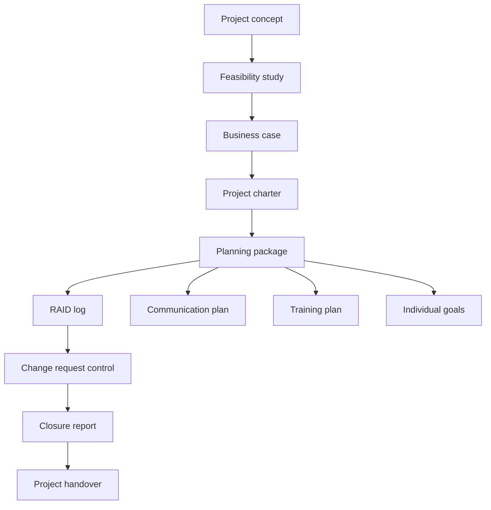
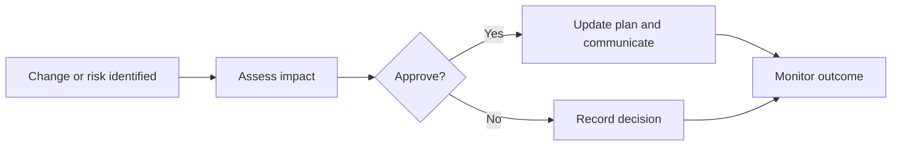

# Management Architecture

## Lifecycle Model

## Knowledge-Area Mapping

| Knowledge area | Repository evidence |
| --- | --- |
| Integration | Charter, change request, closure report. |
| Scope | Feasibility, business case, charter. |
| Schedule | Microsoft Project structure referenced by target repository, future Gantt/WBS exports. |
| Cost | Business case assumptions. |
| Quality | Training plan and closure acceptance context. |
| Resource | Individual goals and planning artifacts. |
| Communication | Communication plan and kickoff presentation. |
| Risk | RAID log and SWOT analysis. |
| Stakeholder | Communication plan, training plan, kickoff material, closure report. |

## Governance Flow

